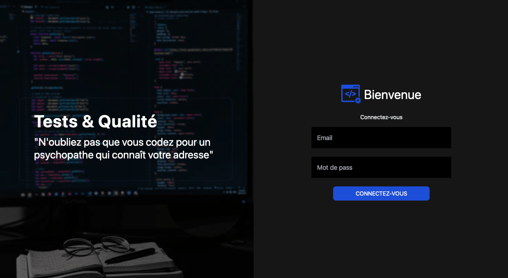

# qualite-tests-auth :
# Exercice dans le cadre du cours Qualité Logiciel et Tests.

## Equipes: Yannick Saint-Just (Yannstj), Lucas Pavin (LucasPavin), Yann Rioual (TocWebProject)

Projet en cours de développement sur la branch develop

## Objectif 1 
<ul>
    <li>**GitHub** pour la gestion du code et de la documentation</li>
    <li>**Jenkins** pour l'automatisation des tests (réaliser les pas de tests unitaires et intégratron de l'application</li>  
    <li>**SonarQube** pour la qualité du code (utiliser les normes de style/codage existants)</li>
</ul>

## Objectif 2  
<li>Réaliser un site web (Nginx) qui permet de visualiser 2 pages différentes à partir d'une authentification réussie. (Hello Mr/Mrs X)</li>

## Environnement de développement :

Dev: Instalation du projet sur une machine virtuel avec VirtualBox et Ubuntu 20.4.3

## Stack & Versions VM:
<ul>
    <li>Jenkins: 2.313</li>
    <li>MariaDB: 0.6.4</li>
    <li>SonarQube: 9.1.0.47736</li>
    <li>Nginx: 1.21.3</li>
</ul>

## Stucture MVC et Composer
<ul>    
    <li>Utilisation de composer</li>
    <li>Utilisation du package phpdotenv pour protéger les accès sensibles dans le code<li>
</ul>

## Installation
<ul>
    <li>cd project directory</li>
    <li>composer install</li>
    <li>ouvrir le fichier .env.example, y ajouter les accès db et retirer l'extension .example - le fichier .env est ajouté au gitgniore pour n'être jamais révéler dans notre GitHub</li>
</ul>

## TODO
<ul>
    <li>Finir les installation des Machines Virtuelles</li>
    <li>Préparer correctement le formulaire View: viewLogin.php avec retour $errors</li>
    <li>Création bdd: Préparer une table users dans une database</li>
    <li>Tester la connection PDO dans le Model Manager.php</li>
    <li>Configuration avec Apache faite via .htaccess (le projet marche sous wamp/mamp) // A faire -> Créer un fichier nginx.conf équivalent pour que le site fonctionne avec nginx sur la VM</li>
</ul>

## Axes d'amélioration
<ul>
    <li>Vérifier en Js les input de l'user avant d'activer la soumission du formulaire</li>
    <li>...</li>
</ul>

## Screenshhot

